# PolyTread Dashboard Guide

This guide explains what each dashboard area means, how to inspect a market safely, and how a
manual order or claim moves from a button to an explicit confirmation.

Start with the [Getting Started guide](GETTING_STARTED.md) if PolyTread is not installed yet.

> [!WARNING]
> The dashboard can submit real-money orders and supported EOA claim transactions. Nothing on the
> chart is a trading recommendation. Confirm the market, outcome, amount, execution type, and
> wallet before approving an action.

> [!NOTE]
> The screenshots use a localhost-only fixture and disposable example values. They never contact a
> wallet or trading endpoint. The latest npm release can briefly lag behind the current source, so
> small wording or layout differences are possible between releases.

## Open the dashboard safely

Start PolyTread and press <kbd>C</kbd> on its runtime screen. Open the complete link, including the
temporary fragment:

```text
http://127.0.0.1:9878/#access=...
```

The fragment creates a local HttpOnly browser session and then disappears from the address bar.
It is normal that refreshing the authenticated page no longer shows `#access`. If the page says
**Dashboard access required**, return to the terminal and copy the newest complete link.

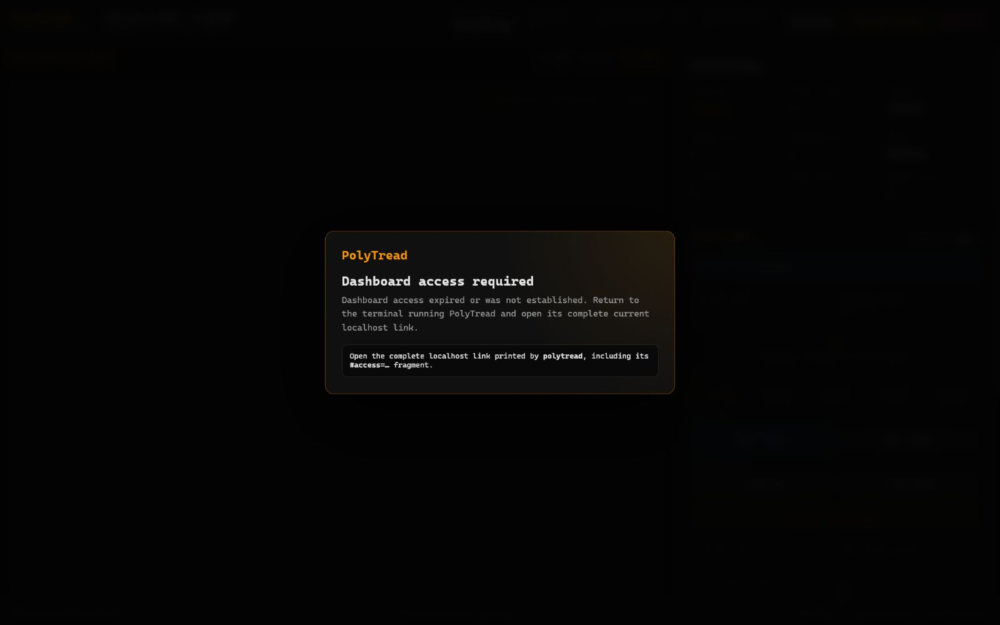

The link is private and changes whenever PolyTread restarts. Do not share, bookmark, or include it
in a screenshot or issue.

## The safest first view

The normal live overview looks like this:


This is also the recommended public README or promotional image: it shows the live product while
trading is visibly off. All values in the repository copy are synthetic examples.

Read the page in this order:

1. **Connection status** — confirm the top-right badge and any warning banner.
2. **Current market** — verify the title, time left, price to beat, and market status.
3. **Price chart** — compare reference prices with the target.
4. **Trading panel** — check whether trading is unavailable, disarmed, or armed.
5. **Live order book** — inspect current bids, asks, spread, and minimum order.
6. **Activity and claims** — review local history or manually handle a claim.

## 1. Connection and market status

The top-right badge summarizes the service connection:

| Badge or state | Meaning | What to do |
| --- | --- | --- |
| `CONNECTING` or waiting | The page is open, but current data is still loading. | Wait. This is normal just after startup or between markets. |
| `LOCAL` | The browser reached the local service, but the first data snapshot has not arrived. | Wait for the market and portfolio snapshot. |
| `LIVE` | Required live feeds are connected. | Continue checking the market and order book before any action. |
| `DEGRADED` | At least one required path is reconnecting or unavailable. | Read the banner. Trading stays blocked when the fresh market book is missing. |
| `RECONNECTING` | The browser lost its local event stream and is retrying. | Keep the service running; check the terminal if it does not recover. |
| `OFFLINE` | The service cannot provide current required data. | Do not trade. Check the terminal and run `polytread diagnose`. |

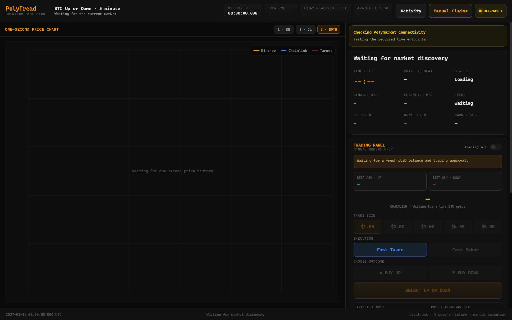

The market card shows:

- **Time Left** — time until this market's close;
- **Price to Beat** — the market's target BTC price;
- **Binance BTC** and **Chainlink BTC** — reference-feed prices, not outcome-token prices;
- **UP Token** and **DOWN Token** — current Polymarket outcome quotes; and
- **Feeds** — how many required feeds are live.

Always read the market title and slug. A number that looks reasonable is not enough evidence that
you are viewing the intended five-minute session.

## 2. Read the price chart

The large chart shows one-second BTC reference-price history. The dashed target line is the current
market's price to beat.

Use the buttons or number keys:

| Control | Shows |
| --- | --- |
| <kbd>1</kbd> · `BN` | Binance only |
| <kbd>2</kbd> · `CL` | Chainlink only |
| <kbd>3</kbd> · `BOTH` | Both feeds together |

[View Binance-only mode](assets/dashboard/08-chart-binance.jpg) ·
[View Chainlink-only mode](assets/dashboard/09-chart-chainlink.jpg)

The chart is context, not an order instruction. The outcome-token prices and executable book are
separate data shown on the right.

## 3. Understand the three trading states

### View-only

If you chose <kbd>N</kbd> during setup, the market and portfolio remain visible but browser order
buttons stay unavailable.

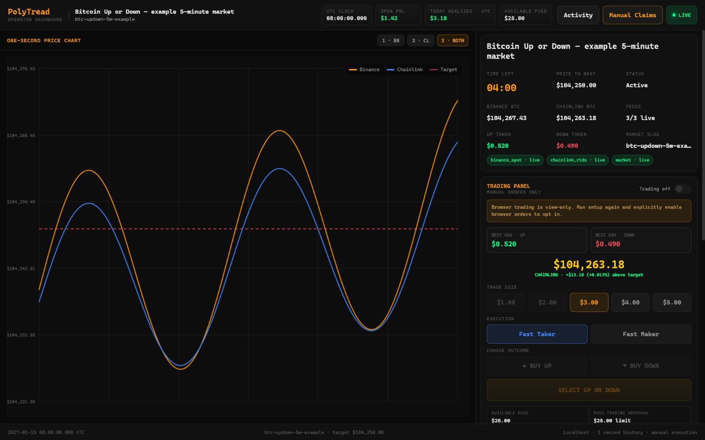

To change that choice later, stop PolyTread, run `polytread setup --force`, and complete the safety
choice again. A forced setup replaces saved settings, so do not run it while the old service is
active.

### Available but disarmed

If browser trading was enabled during setup, each new dashboard session still starts with
**Trading off**. This is the safe normal state. No outcome button can submit an order.

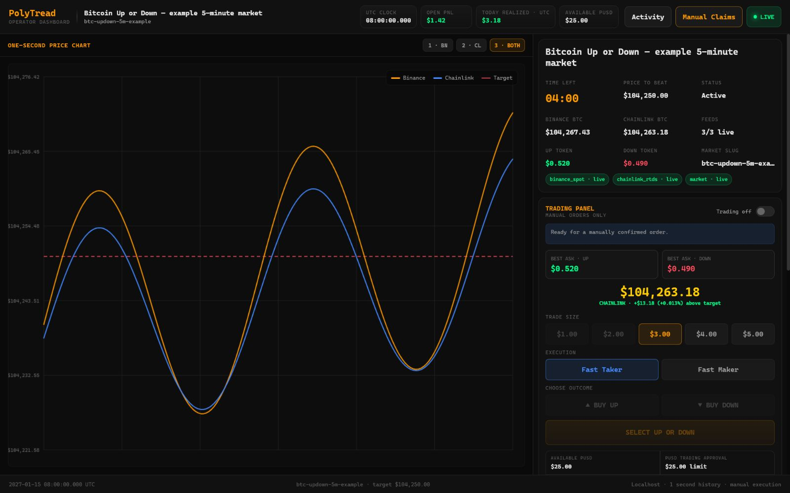

### Armed

The **Arm browser trading** switch makes the manual controls available for the current running
service. Arming alone does not choose an outcome or place an order.

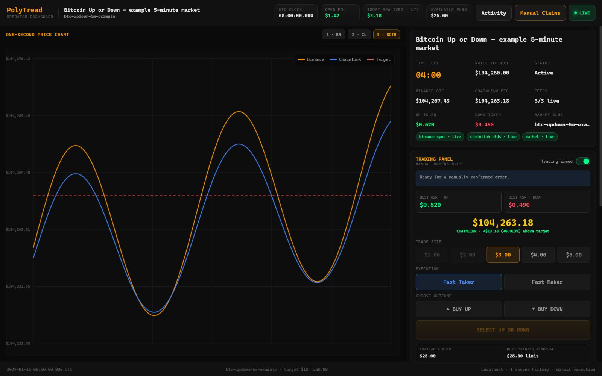

If the feed, balance, approval, session, or order book becomes unsafe or stale, the relevant
controls disable even while the switch is armed.

## 4. Prepare a manual order

Only continue when you intend to trade real funds.

### Choose an amount

The amount buttons are nominal pUSD order values. PolyTread disables a value when it is:

- below the current market's minimum shares at the bounded order price;
- above the fresh available pUSD balance;
- above the current pUSD trading approval; or
- unavailable because the required market data is stale.

**Available pUSD** is the fresh usable balance. **pUSD Trading Approval** is the exchange allowance,
not a second balance. The smaller of the two limits a buy.

### Choose the execution type

| Choice | Plain meaning | Main trade-off |
| --- | --- | --- |
| **Fast Taker** | Uses a bounded price near the current best ask. | More likely to fill quickly, but can cost more. |
| **Fast Maker** | Posts a lower bounded limit price. | Can cost less, but may remain open or never fill. It is disabled too close to market close. |

Changing the execution type can change the minimum valid amount shown below the order book.

### Choose the outcome

Press **BUY UP** if the intended outcome is UP or **BUY DOWN** if the intended outcome is DOWN. The
large final button then repeats the outcome and amount.

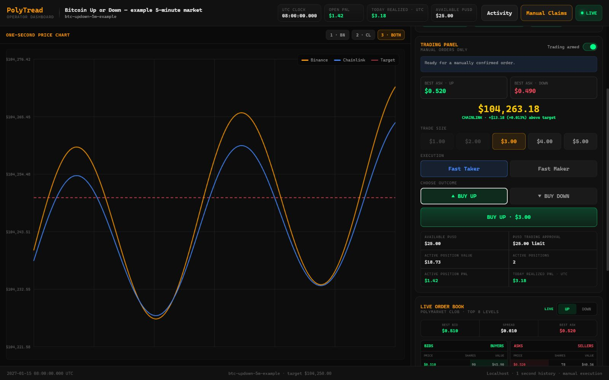

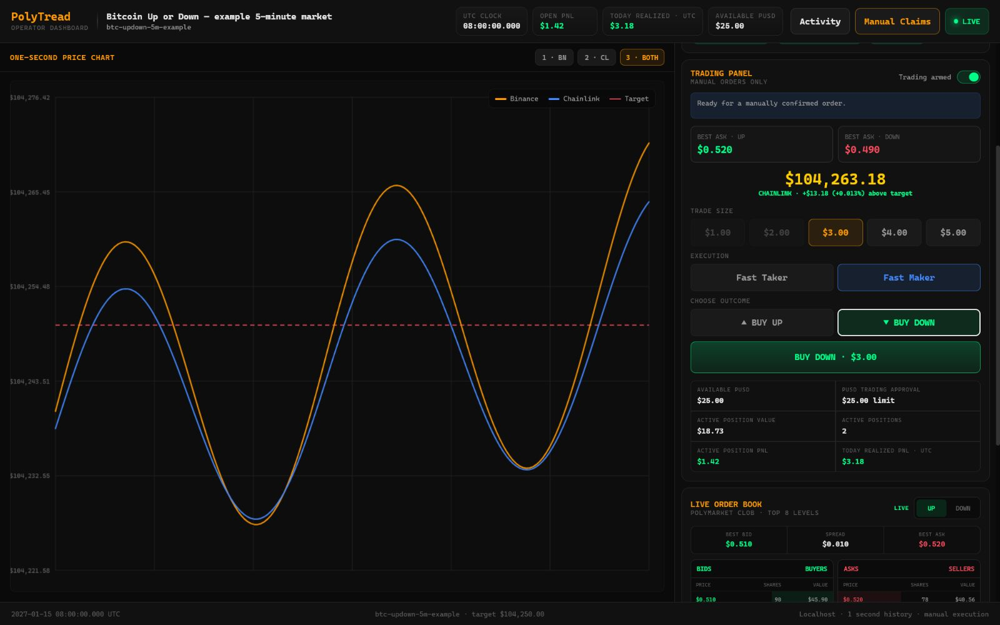

The `UP` and `DOWN` tabs inside the order book only change which book you are inspecting. They do
**not** choose the order outcome. Use the separate **BUY UP** or **BUY DOWN** buttons in the trading
panel.

### Confirm the order

Press the large final order button only after the summary is correct. Your browser then shows a
native confirmation such as:

```text
BUY DOWN $3.00 using Fast Maker?
```

Canceling that prompt sends nothing. Approving it sends one manual request; it does not start a
strategy or repeat the trade. The confirmation appearance is supplied by your browser and
operating system, so it is intentionally described instead of represented by one misleading
browser-specific screenshot.

The backend still rechecks the active session, request ID, fresh balance and approval, position
limits, market rules, and bounded price. A browser confirmation is permission to request the
order, not a promise that the exchange will fill it.

## 5. Read the live order book

The order book shows up to eight current levels for one outcome:

- **Bids / Buyers** — prices buyers currently offer;
- **Asks / Sellers** — prices sellers currently request;
- **Best Bid**, **Best Ask**, and **Spread** — the top prices and their difference;
- **Shares** — outcome-token quantity at that level;
- **Value** — price multiplied by shares; and
- the bottom rule line — minimum shares, price tick, and current taker or maker minimum.

The depth bar is a summary of the displayed levels, not a forecast. If the book says `STALE` or
`OFFLINE`, prices are cleared and order controls remain blocked.

[View the full UP order book](assets/dashboard/20-orderbook-up.jpg) ·
[View the full DOWN order book](assets/dashboard/21-orderbook-down.jpg)

## 6. Review balances, positions, and PnL

The header and trading panel separate four ideas:

| Value | Meaning |
| --- | --- |
| **Available pUSD** | Fresh collateral available for a new order. |
| **pUSD Trading Approval** | Maximum collateral currently approved for exchange use. |
| **Active Position Value** | Current marked value of open positions. |
| **Open / Realized PnL** | Marked open profit or loss, and completed profit or loss for the current UTC day. |

PnL can change with market data and is not a guaranteed settlement value. A dash means the latest
portfolio or balance information is not fresh enough to display safely.

## 7. Use Activity

Press **Activity** or **View all** to open local history. This data is stored for the current
operating-system user.

### Order History

Shows time, market, side, execution type, price, shares, and the latest known status.

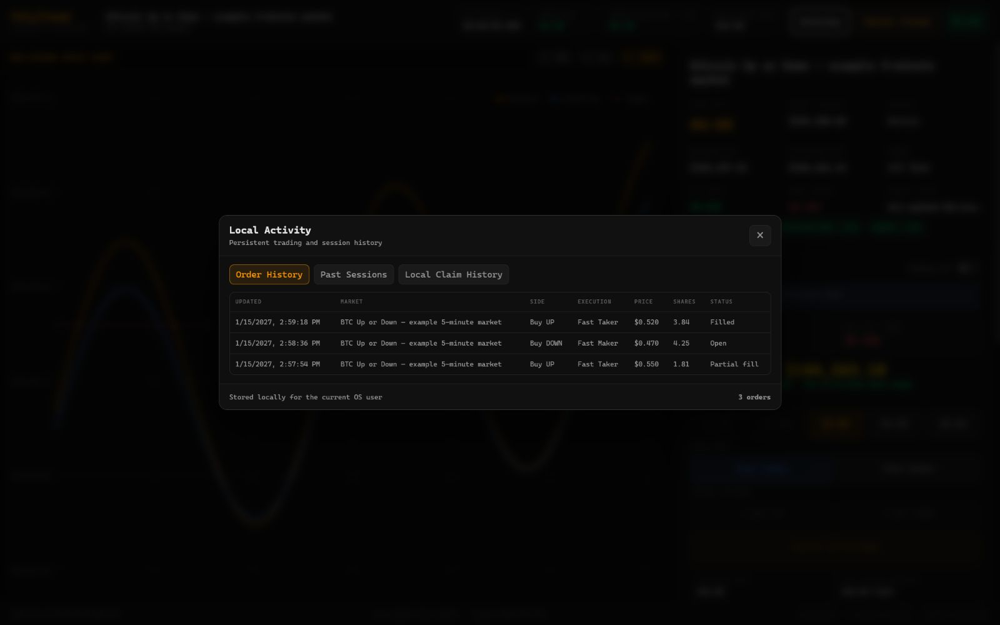

### Past Sessions

Shows previously discovered markets, their start time, target, window, and slug.

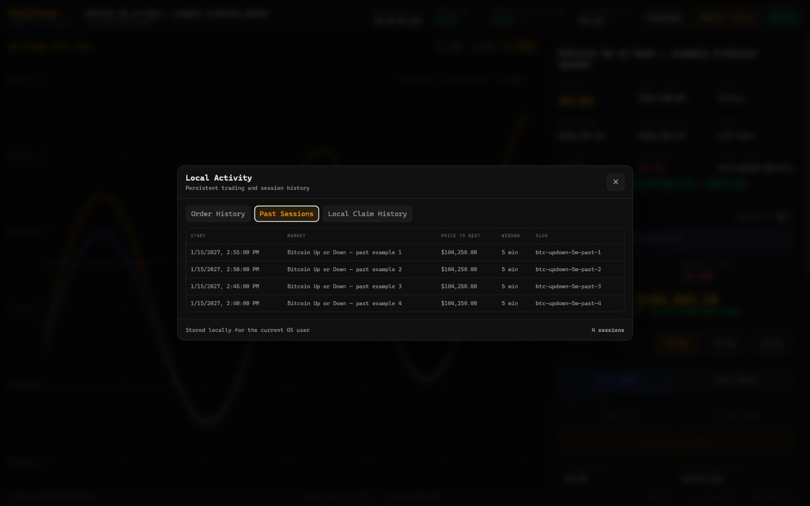

### Local Claim History

Shows claims PolyTread submitted and their transaction hashes. It does not claim automatically.

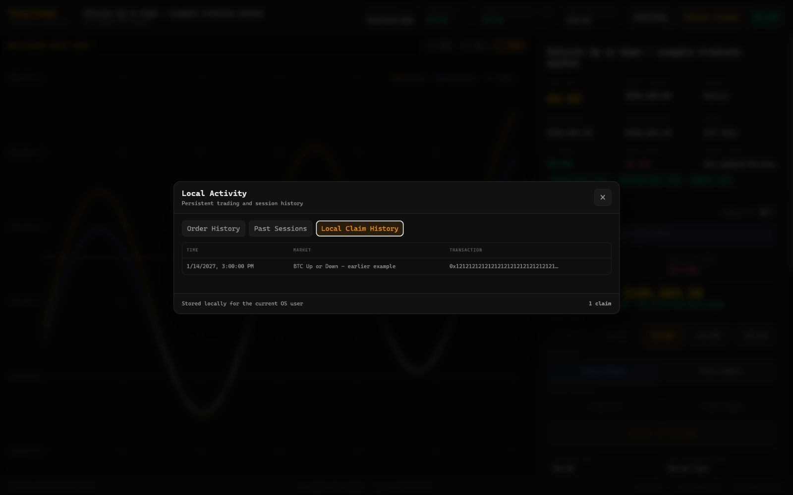

Press <kbd>Esc</kbd>, the close button, or the shaded area outside the dialog to close an activity
or claims overlay.

## 8. Handle claims manually

Press **Manual Claims** to see positions that appear ready to redeem. Merely opening this dialog
does not submit anything.

### Direct EOA wallet

For a supported EOA, each position has its own **Claim** button.

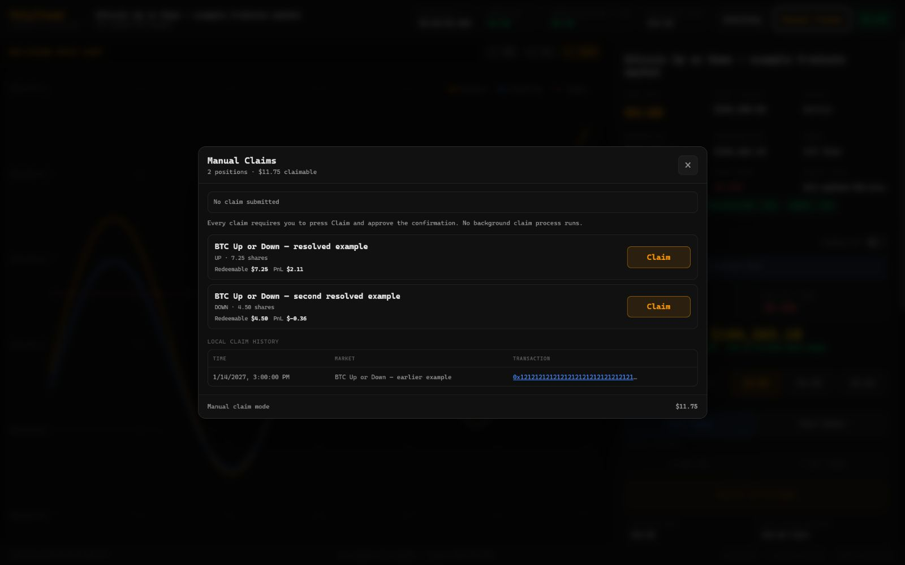

After you press **Claim**, the browser asks for a second explicit confirmation. A confirmed claim
submits a Polygon transaction. POL may be required for gas, and a one-time collateral-adapter
approval can also be required.

### Safe, proxy, or deposit wallet

These wallet types require Polymarket's separately authenticated wallet flow. PolyTread keeps the
positions visible but sends you to the official Portfolio page instead of collecting builder or
relayer credentials.

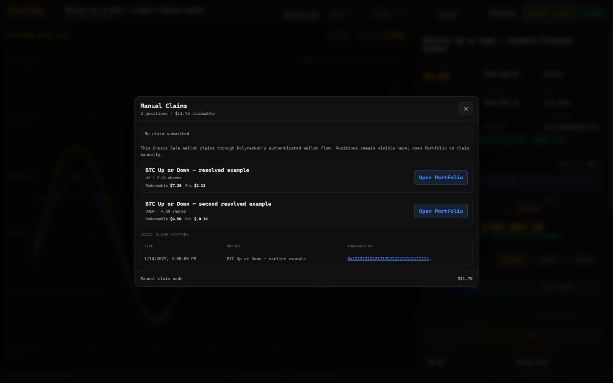

### Nothing to claim

An empty list is normal when no supported position is currently redeemable.

[View the empty claims state](assets/dashboard/18-claims-empty.jpg)

The same dialog reports a claim that is
[in progress](assets/dashboard/42-claim-in-progress.jpg),
[rejected](assets/dashboard/43-claim-error.jpg), or
[submitted successfully](assets/dashboard/44-claim-success.jpg). A success message records a
transaction hash; it does not turn claims into a background process.

## 9. Recognize safety blocks

### Degraded connection

The page can keep showing healthy reference prices while a required market path reconnects. Read
the banner; missing or stale executable data keeps trading blocked.

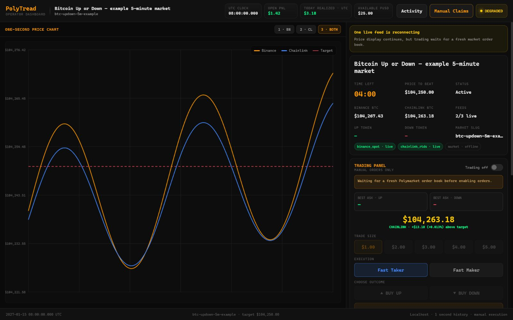

### Stale order book

The market feed can be connected while the latest book is too old to use. PolyTread clears the
depth and disables outcome and amount controls until a fresh book arrives.

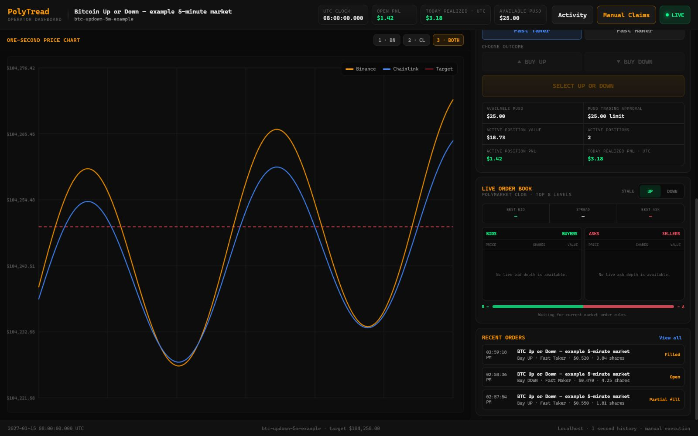

### No balance or approval

The page can be live while the wallet has no usable pUSD or approval. The warning states the
balance, approval, required amount, and shortfall separately.

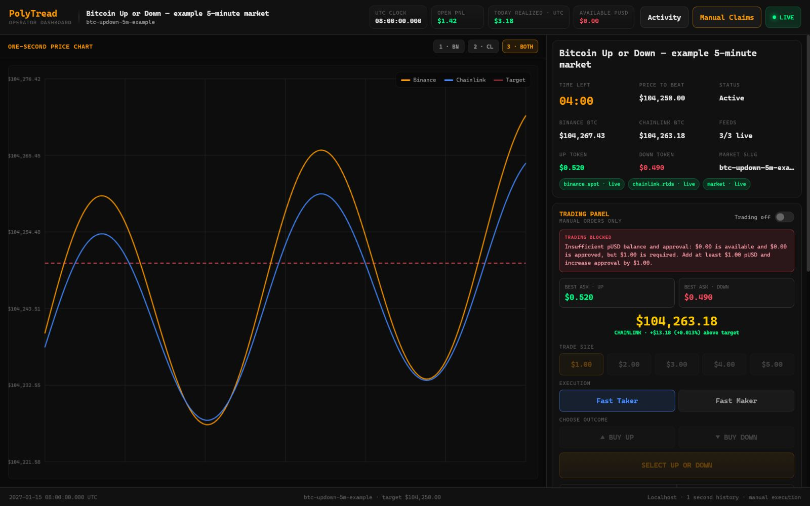

Do not treat a disabled button as a browser bug until you read the notice, connection badge,
balance, approval, order-book status, and minimum rule line.

More specific screenshots distinguish a [stale balance](assets/dashboard/32-balance-stale.jpg), a
[balance-check error](assets/dashboard/33-balance-error.jpg), a
[balance-only shortfall](assets/dashboard/34-balance-shortfall.jpg), an
[approval-only shortfall](assets/dashboard/35-approval-shortfall.jpg), and a
[market minimum above current capacity](assets/dashboard/36-minimum-too-high.jpg).

## 10. Narrow windows and phones

The dashboard rearranges into a single-column view in a narrow browser window:

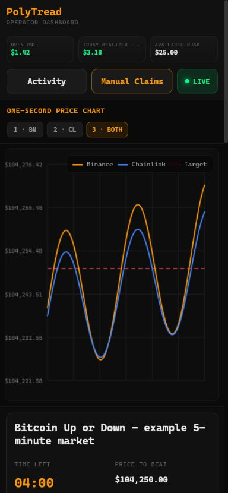

A desktop-width browser is recommended when comparing the chart, trading panel, and order book.
The repository screenshot represents a narrow window on the **same computer**. A URL beginning
with `127.0.0.1` on a phone points to the phone itself, not to PolyTread running on your computer.
PolyTread does not expose a public or LAN dashboard by default.

For layout review, the gallery also includes the [1280×960 compact desktop](assets/dashboard/49-responsive-1280.jpg),
the [1024×1200 stacked layout](assets/dashboard/50-responsive-1024-stacked.jpg), and a
[390×844 activity dialog](assets/dashboard/48-mobile-activity.jpg) whose wide table scrolls inside
the modal.

## Complete dashboard screenshot reference

These 50 numbered images cover every meaningful independent page, safety, selection, feed,
portfolio, overlay, empty-data, and responsive state in the current dashboard. They deliberately
avoid a Cartesian set of visually identical combinations; changing the chart feed, for example,
does not need to be repeated for every activity tab.

Browser-native order and claim confirmations are described in the relevant sections because their
appearance comes from the user's browser and operating system. Fresh-but-empty order-book depth
and an aged order book intentionally converge on the same safe `STALE` view shown in state 11.

### Core flow and controls

| # | State | Screenshot |
| ---: | --- | --- |
| 01 | Access missing or expired | [View](assets/dashboard/01-access-required.jpg) |
| 02 | Connecting and waiting for a market | [View](assets/dashboard/02-connecting-and-waiting.jpg) |
| 03 | Live view-only mode | [View](assets/dashboard/03-live-view-only.jpg) |
| 04 | Live, trading available but disarmed | [View](assets/dashboard/04-live-disarmed.jpg) |
| 05 | Trading armed, no outcome chosen | [View](assets/dashboard/05-trading-armed.jpg) |
| 06 | BUY UP with Fast Taker | [View](assets/dashboard/06-buy-up-taker.jpg) |
| 07 | BUY DOWN with Fast Maker | [View](assets/dashboard/07-buy-down-maker.jpg) |
| 08 | Binance-only chart | [View](assets/dashboard/08-chart-binance.jpg) |
| 09 | Chainlink-only chart | [View](assets/dashboard/09-chart-chainlink.jpg) |
| 10 | Degraded market feed | [View](assets/dashboard/10-degraded-feed.jpg) |
| 11 | Stale order book | [View](assets/dashboard/11-stale-order-book.jpg) |
| 12 | No usable pUSD balance or approval | [View](assets/dashboard/12-no-funds.jpg) |
| 13 | Activity: order history | [View](assets/dashboard/13-activity-order-history.jpg) |
| 14 | Activity: past sessions | [View](assets/dashboard/14-activity-past-sessions.jpg) |
| 15 | Activity: local claim history | [View](assets/dashboard/15-activity-claim-history.jpg) |
| 16 | Claims: direct EOA path | [View](assets/dashboard/16-claims-direct-wallet.jpg) |
| 17 | Claims: Safe/proxy Portfolio path | [View](assets/dashboard/17-claims-proxy-wallet.jpg) |
| 18 | Claims: nothing currently claimable | [View](assets/dashboard/18-claims-empty.jpg) |
| 19 | Narrow-window layout | [View](assets/dashboard/19-mobile-dashboard.jpg) |
| 20 | Full UP order book | [View](assets/dashboard/20-orderbook-up.jpg) |
| 21 | Full DOWN order book | [View](assets/dashboard/21-orderbook-down.jpg) |

### Connection and market-data states

| # | State | Screenshot |
| ---: | --- | --- |
| 22 | Local service connected; first snapshot pending | [View](assets/dashboard/22-local-connection.jpg) |
| 23 | Local event stream reconnecting | [View](assets/dashboard/23-reconnecting.jpg) |
| 24 | DNS filtering diagnostic | [View](assets/dashboard/24-dns-filtering.jpg) |
| 25 | Required endpoint restricted | [View](assets/dashboard/25-endpoint-restricted.jpg) |
| 26 | Required Polymarket paths unreachable | [View](assets/dashboard/26-unreachable.jpg) |
| 27 | Current market closing | [View](assets/dashboard/27-closing-market.jpg) |
| 28 | Market target not yet available | [View](assets/dashboard/28-missing-target.jpg) |
| 29 | Chainlink reference price missing | [View](assets/dashboard/29-missing-chainlink.jpg) |
| 30 | Chainlink below the target | [View](assets/dashboard/30-chainlink-below-target.jpg) |
| 31 | Chainlink exactly at the target | [View](assets/dashboard/31-chainlink-at-target.jpg) |

### Trading, portfolio, and claim-result states

| # | State | Screenshot |
| ---: | --- | --- |
| 32 | Balance and approval data stale | [View](assets/dashboard/32-balance-stale.jpg) |
| 33 | Balance refresh error | [View](assets/dashboard/33-balance-error.jpg) |
| 34 | Balance-only shortfall | [View](assets/dashboard/34-balance-shortfall.jpg) |
| 35 | Approval-only shortfall | [View](assets/dashboard/35-approval-shortfall.jpg) |
| 36 | Current market minimum above usable capacity | [View](assets/dashboard/36-minimum-too-high.jpg) |
| 37 | Fast Maker disabled near market close | [View](assets/dashboard/37-maker-cutoff.jpg) |
| 38 | Manually confirmed order in flight | [View](assets/dashboard/38-in-flight-order.jpg) |
| 39 | Order rejected or failed | [View](assets/dashboard/39-order-error.jpg) |
| 40 | Portfolio data stale | [View](assets/dashboard/40-portfolio-stale.jpg) |
| 41 | Negative open and realized PnL | [View](assets/dashboard/41-negative-pnl.jpg) |
| 42 | Manual claim in progress | [View](assets/dashboard/42-claim-in-progress.jpg) |
| 43 | Manual claim rejected or failed | [View](assets/dashboard/43-claim-error.jpg) |
| 44 | Manual claim submitted successfully | [View](assets/dashboard/44-claim-success.jpg) |

### Empty-data and responsive states

| # | State | Screenshot |
| ---: | --- | --- |
| 45 | Activity: no order history | [View](assets/dashboard/45-activity-empty-orders.jpg) |
| 46 | Activity: no past sessions | [View](assets/dashboard/46-activity-empty-sessions.jpg) |
| 47 | Activity: no local claim history | [View](assets/dashboard/47-activity-empty-claims.jpg) |
| 48 | Phone-sized activity dialog with horizontal table scrolling | [View](assets/dashboard/48-mobile-activity.jpg) |
| 49 | Compact 1280×960 desktop layout | [View](assets/dashboard/49-responsive-1280.jpg) |
| 50 | Stacked 1024×1200 layout | [View](assets/dashboard/50-responsive-1024-stacked.jpg) |

## Runtime screen reference

The terminal runtime has a separate 13-state gallery covering startup checks, vault access,
degraded checks, saved permissions, active/degraded/attention states, URL copy results, startup
failure, and a small terminal.

<details>
<summary>Open the 13-screen runtime contact sheet</summary>

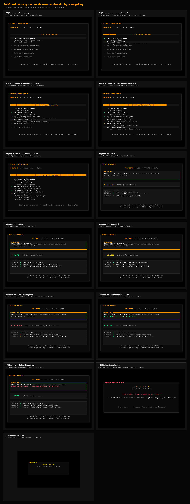

</details>

## Using these screenshots publicly

- Use [`cover-dashboard.png`](assets/dashboard/cover-dashboard.jpg) for the README, a project card,
  or a general product preview. It is live-looking, complete, synthetic, and visibly disarmed.
- Use [`promo-dashboard.png`](assets/dashboard/promo-dashboard.jpg) for a capability-focused public
  preview or ad. It is the strongest product frame—both feeds are live and a $3 BUY UP Fast Taker
  choice is visible—but it must be captioned as a synthetic, manually armed demonstration that has
  not been submitted.
- Use the setup [completion screen](assets/setup/states/23-complete-enabled.png) when explaining the
  secure install-to-runtime handoff.
- Keep error, access, degraded, and no-funds images for guides and support material rather than a
  product cover.
- Never publish a real `#access` fragment, private key, wallet secret, authenticated RPC URL, or
  unredacted user account information.

Return to [Getting Started](GETTING_STARTED.md) or read [Configuration](CONFIGURATION.md) for local
files, environment settings, and trading gates.
